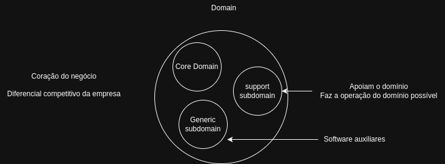
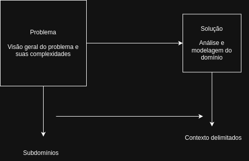

# Curso - Full Cycle 3.0 - Domain-Driven Design

## O que é DDD?

- É uma forma de desenvolver software com foco no coração da aplicação - o que chamamos
de domínio - tendo o objetivo de entender regras, processos e complexidades,
separando-as assim de outros ponmtos complexos que normalmente são adicionados durante o
processo de desenvolvimento.

## De onde surgiu o DDD?

- Eric evans

- Livro lançado em 2003
  - Filosofia
  - Exemplos reais
  - Patterns

- Comunidade de entusiastas seguindo essa prática

- Lançamento de outros livros

## Softwares Complexos

- DDD é / deve ser aplicado para casos de projetos de softwares complexos

- Grandes projetos possuem mais áreas, muitas regras de negócio, muitos processos
com diferrentes visões em diferentes contextos

- Não há como não utilizar técnicas avançadas em projetos de alta complexidade

- Grande parte da complexidade desse tipo de software não vem da tecnologia, mas sim da
comunicação, separação de contextos, entendimento do negócio por viversos ângulos

- Pessoas

## Como o DDD pode ajudar?

- Entender com profundidade o domínio e subdomínios da aplicação

- Ter uma linguagem universal (linguagem ubíqua) entre todos os envolvidos

- Criar o design estratégico utilizando Bounded Contexts

- Criar um design tático para conseguir mapear e agragar as entidades e objetos de valor da
aplicação, bem como os eventos de domínio

- Clareza do que é complexidade de negócio e complexidade técnica

# Domínio e Subdomínios

  

# Problema vs Solução

  

